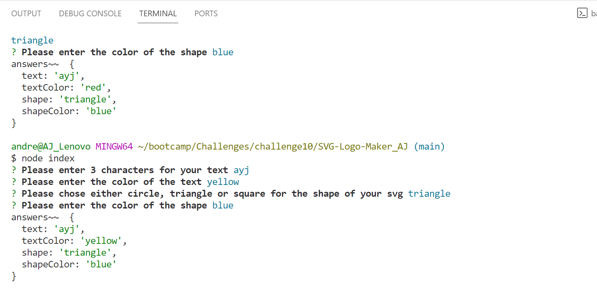

# SVG-Logo-Maker_AJ

The motivation for this code is for the user to create a simple logo for their project.

This project is a work in progress, I am still learning how to incoporate the testing and I not finished.   I have learned about render and promises.

What makes this project stand out is when prompted for a shape, color and 3 charactors, it prints out all 3.  

I collaborated with a tudor and some of the code was obtained from the assignments.

Still need to get this give an output of a generated logo.

Link to the screencastify
https://drive.google.com/file/d/1jA3iq7HwyYs0fB6dJWsx7gs6TD5mvjNs/view

